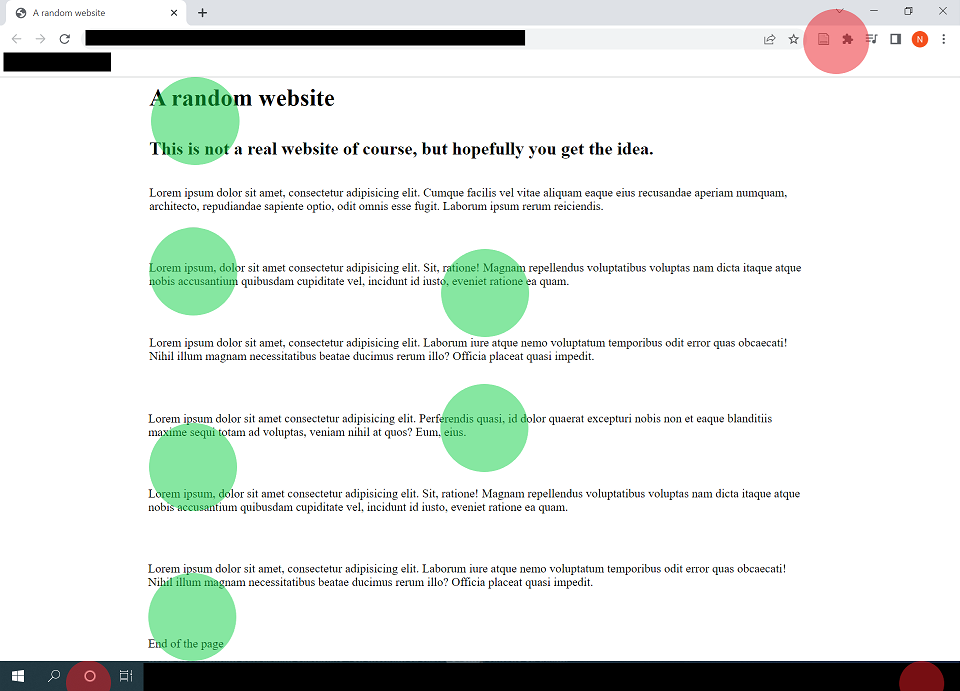
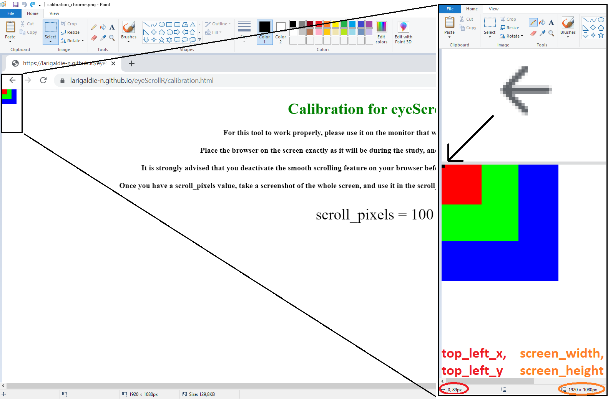
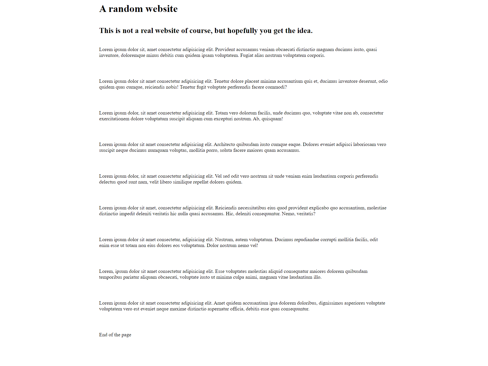
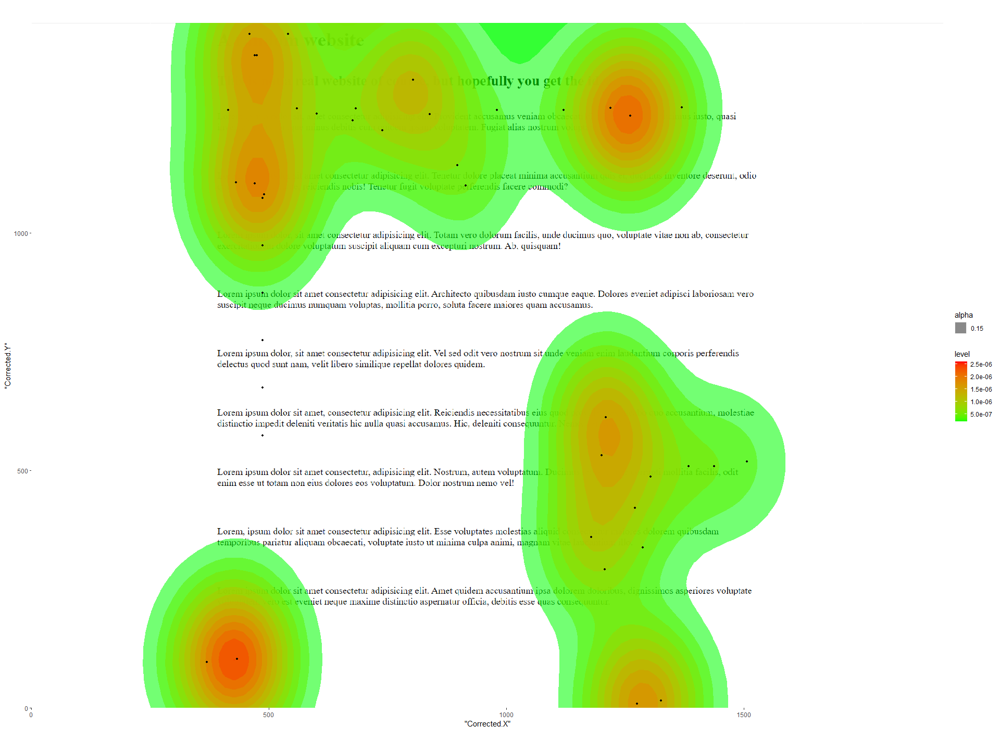

```{r, include = FALSE}
knitr::opts_chunk$set(
  collapse = TRUE,
  comment = "#>"
)
```

The goal of eyeScrollR is to extract the necessary information from eye tracking data to easily and automatically place gazes and fixations on the right areas of a scrollable website.

Usually, eye tracking data consist of arrays of fixation coordinates on the screen itself. If a participant is staring right in the middle of a screen with resolution 1920 * 1080, the eye tracking software will return an array of records with coordinates x = 960; y = 540. When the material being watched is static and does not overflow, converting coordinates from the screen to coordinates on the image can be effortless (and even automatically made by the software).

However, if the participant has the option to scroll down on the application he is using, this conversion suddenly can become difficult, and some researchers end up either making endless manual corrections or even abandoning these research settings altogether. With this package, only a few minutes of preparation should be needed for most researchers to perform these conversions without sacrificing much ecological validity. This documentation was designed to make the use of this package as easy as possible, with reproducible step-by-step examples.

Provided that you already have an image, a dataset, and correct measurements, outputting a correct heatmap from the eye-tracker's raw data may be as simple as this:


```{r eval=FALSE}
library(eyeScrollR)
calibration <- scroll_calibration_auto(calibration_image = calibration_image,
                                       scroll_pixels = 100)
data <- eye_scroll_correct(eyes_data = dataset, timestamp_start = 2000,
                            timstamp_stop = 50000, image_width = 1920,
                            image_height = 10000, calibration = calibration)
generate_heatmap(data = data, heatmap_image = heatmap_image)
```

# Before you start

## Understand the use-case scenario

Consider this situation, where a participant fixates 6 different areas on a screen (represented by red and green spots) while browsing a website, scrolls down, and then fixates the 6 exact same areas:

```{r, echo=FALSE, out.width="100%"}
knitr::include_graphics("example_eyeScrollR_small_vertical.png")
```

Although red fixation spots do indeed match the same content in both situations, green fixations spots don't; and any analysis on the content being fixated should convert those screen coordinates to the "content coordinates".

In other words, if we unrolled the content of the screen to a single long image, we would like the fixations to be correctly placed on it, as so:

```{r, echo=FALSE, out.width="100%"}

```

... Which is exactly what this package is for.

On top of this, we may often want to get rid of anything outside the website itself (such as the browser header, the Windows bar at the bottom, etc.), and some areas of websites might be static and follow the screen even when the participant scrolls down. eyeScrollR is equipped to deal with such situations.

**Please note that, as of now, eyeScrollR has only been tested on data from the iMotions software. Future support for other software should be expected, but is not yet guaranteed.**


## Set up the experimental setting

Although eyeScrollR deals with the participant's data, getting the most reliable and accurate placements and timings may require changing a few browser settings. These steps are not completely necessary, but if omitted may often result in a few pixels of inaccuracy in the fixation's coordinates, and they may be temporarily ahead of time by up to \~150ms during scrolling blur periods. Quite rarely, it may mess up with the whole file; especially if the participant had a very fast-paced and erratic scrolling pattern.

This is why it is recommended to deactivate the smooth scrolling on your browser and to get rid of the side scrollbar. In Chrome/Chromium browsers, deactivating the smooth scrolling can easily be done by typing "<chrome://flags/>" in the address bar and disabling the "Smooth Scrolling" option. Similarly, the scrollbar can be hidden by enabling the "Overlay Scrollbars" option.

In Firefox browsers, a few free extensions can easily be found to hide the scrollbar, and smooth scrolling can be deactivated directly from the settings menu.

## Anticipate the necessary information & material

eyeScrollR is mainly designed to work on full page images of websites. Those can be automatically captured through various free or paid extensions for Chromium/Firefox browsers (and probably more), or manually constructed/modified if necessary. The resulting image should be a full page image, with an horizontal size equal to that of your browser viewing area and a vertical size equal to the total length of the webpage. Procuring this image is left to the reader's preferences.

Once you have this image, all you need are a few measurements on the monitor used for the experiment, an eye-tracking dataset *including the participant's mouse inputs and fixation coordinates*, and you are all set.

Some of these measurements can be done automatically through the [Calibration page](../calibration.html "Calibration page"), but they can also be input manually if necessary.

# A complete example

If you so desire, you should be able to follow along (the webpage used for this example can be found [here](../test_no_fixed.html "simple test page")).

Arguably, the first step before even getting eye-tracker data would be to get all the measurements ready for the "calibration" phase.

## Calibrate

If this is your first time using this package, it is advisable to check the results from the automatic calibration with the manual one to check for consistency. If any discrepancy is found or if the automatic calibration fails, please revert to the manual one.

The purpose of the calibration is to feed the program with the size of the screen, the location of the browsing area inside the screen, and how many pixels are being scrolled each time a participant scrolls down or up on the browser that will be used.

You just have to go to the [Calibration page](../calibration.html "Calibration page") and follow the instructions. Once you have the scroll_pixels value, take a screenshot of the whole screen, including the calibration page, and save it as an image file.

If you have several monitors on the computer, make sure to only take a screenshot of the monitor on which the eye-tracker is used. Therefore, the resulting image should be exactly the same size as your monitor resolution.

### Automatic calibration

This is the fastest and easiest way to calibrate. Just pass the screenshot you just took along with the scroll_pixels value to the scroll_calibration_auto function. For instance:

```{r eval=FALSE}
library(eyeScrollR)
library(png)
calibration_image <- readPNG("calibrate.png")
calibration <- scroll_calibration_auto(calibration_image = calibration_image,
                                       scroll_pixels = 100)
```

The calibration should now be over!

### Manual calibration

Should automatic calibration fail, you can always do it manually. Just open the screenshot you took earlier and look for the coordinates of the pixels in the most to the top left and to the bottom right of the browsing area. The search is made easier by the colored squares in those corners.

Most graphics editors should allow you to easily get the image size and coordinates of the pixel you are interested in by just zooming and placing your cursor on it (for the example below, the pixel you are interested in was colored in black).

```{r, echo=FALSE, out.width="100%"}

```

Repeat the same process for the bottom rightmost pixel.

You then just have to report the values in the *scroll_calibration_manual* function:

```{r eval=FALSE}
library(eyeScrollR)
calibration <- scroll_calibration_manual(screen_width = 1920, screen_height = 1080,
                                         top_left_x = 0, top_left_y = 89,
                                         bottom_right_x = 1919, bottom_right_y = 1029,
                                         scroll_pixels = 100)
```

## Get some data, and the website image

The next step is to get a full page image of the website. As mentioned earlier, there are several ways to achieve this and many browser extensions are available. In our case, we ended up with this simple image:


```{r, echo=FALSE, out.width="100%"}

```

This image width and height are to be passed to the *eye_scroll_correct* function in the next section.

## Convert

After a careful examination of the video of the participant’s session and the key events, it could be determined in our example that the participant was looking at the webpage of interest from timestamps 3577 to 30864. All we need now is to import our dataset, which includes the fixation coordinates, mouse events, and timestamps. After that, we can apply the correction!

```{r eval=FALSE}
library(readr)
test_data <- read_csv("test_data.csv", comment = "#")
names(test_data) <- make.names(names(test_data))
corrected_data <- eye_scroll_correct(eyes_data = test_data,
                                     timestamp_start = 3577,
                                     timestamp_stop = 30864,
                                     image_width = 1920,
                                     image_height = 1442,
                                     calibration = calibration)
```

The dataset itself has to respect the standard naming conventions from the iMotions software (see more details on the *eye_scroll_correct* help page).

## Output!

Finally you can use the built-in heatmap generation function if your dataset included fixation data:

```{r eval=FALSE}
heatmap_image <- readPNG("a_random_website.png")
generate_heatmap(data = corrected_data, heatmap_image = heatmap_image)
```

```{r, echo=FALSE, out.width="100%"}

```

# A more complicated setting?

This example was kept simple on purpose, by not having any fixed area inside the webpage. For a more complicated example using fixed areas that are also changing in size during the scrolldown, you can visit the [article on fixed areas](fixed_areas.html "article on fixed areas")
