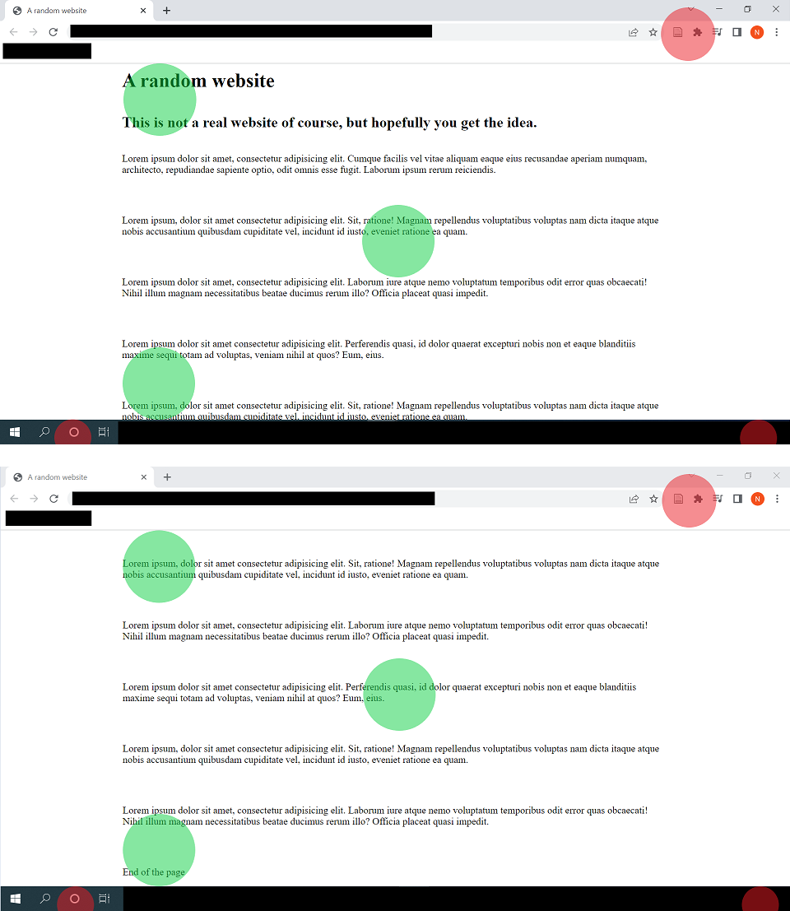

```{r, include = FALSE}
knitr::opts_chunk$set(
  collapse = TRUE,
  comment = "#>"
)
```

The goal of eyeScrollR is to extract the necessary information from eye-tracking data to easily and automatically place fixations on the right areas of a scrollable website.

Usually, eye-tracker data consist in arrays of fixation coordinates on the screen itself. If a participant is staring right at the middle of a screen with resolution 1920\*1080, eye-tracking software will therefore return an array of fixation records with coordinates x = 960; y = 540. When the material being watched is static and does not overflow, converting coordinates from the screen to coordinates on the image can be effortless (and even automatically made by the software).

However, if the participant has the option to scroll down on the application he is using, this conversion suddenly can become difficult, and some researchers end up either making endless manual corrections, or even abandoning these research settings altogether. With this package, only a few minutes of preparation should be necessary for most researchers to perform these conversions without sacrificing too much ecological validity. This documentation was designed to make the use of this package as easy as possible, with step-by-step reproducible examples.

Provided that you already have an image, a dataset and correct measurements, outputting a correct heatmap from the eye-tracker's raw data may be as simple as this:

```{r eval=FALSE}
library(eyeScrollR)
calibration <- scroll_calibration(screen_width = 1920, screen_height = 1080,
                 top_left_x = 0, top_left_y = 108, bottom_right_x = 0,
                 bottom_right_y = 40, scroll_pixels = 100)
data <- eye_tracker_fixation_scroll(eyes_data = dataset, timestamp_start = 2000,
                            timstamp_stop = 50000, image_width = 1920,
                            image_height = 10000, calibration = calibration)
generate_heatmap(data, img)
```

# Before you start

## Understand the use-case scenario

Consider this situation, where a participant fixates 5 different areas on a screen (represented by red and green spots) while browsing a website, scrolls down, then fixates the 5 exact same areas:

```{r, echo=FALSE, out.width="100%"}

```

Although red fixation spots do indeed match the same content in both situations, green fixations spots don't; and any analysis on the content being fixated should convert those screen coordinates to the "content coordinates".

In other words, if we unscrolled the content of the screen to a single long image, we would like the fixations to be correctly placed on it, as so:

```{r, echo=FALSE, out.width="100%"}
knitr::include_graphics("example_eyeScrollR_vertical_full.png")
```

... Which is exactly what this package is for.

On top of this, we may often want to get rid of anything outside the website itself (such as the browser header, the Windows bar at the bottom, ...), and some areas of websites might be fixed and follow the screen as the participant scrolls down. eyeScrollR is equipped to deal with such situations.

**Please do note that as of now, eyeScrollR has only been tested on data from the iMotions software. Future support for other software should be expected, but is not yet guaranteed.**

## Set up the experimental setting

Although eyeScrollR is dealing with the participant's data, getting the most reliable and accurate placements and timings may require to change a few browser settings. These steps are not completely necessary, but if omitted may often result in a few pixels of inaccuracy in the fixation's coordinates, and they may be temporarily ahead of time by up to \~150ms during scrolling blur periods. Quite rarely, it may mess up with the whole file; especially if the participant had a very fast-paced and erratic scrolling pattern.

This is why it is recommended to deactivate the smooth scrolling on your browser, and to get rid of the side scrollbar. In Chrome/Chromium browsers, deactivating the smooth scrolling can easily be done by typing "<chrome://flags/>" in the address bar, and disabling the "Smooth Scrolling" option. Similarly, the scrollbar can be hidden by enabling the "Overlay Scrollbars" option.

In Firefox browsers, a few free extensions can easily be found to hide the scrollbar and smooth scrolling can be deactivated directly from the settings menu.

## Anticipate the necessary information & material

eyeScrollR is mainly designed to work on "unscrolled" images of websites. Those can be automatically captured through various free or paid extensions for Chromium/Firefox browsers (and probably more), or manually constructed/modified if necessary. The resulting image should be an unscrolled image, with an horizontal size equal to that of your browser viewing area and a vertical size equal to the total length of the webpage. Procuring this image is let to the reader's preferences.

Once you have this image, all you need are a few measurements on the monitor used for the experiment, an eye-tracking dataset *including the participant's mouse inputs and fixation coordinates*, and you are all set.

Some of these measurements can be done automatically through the [Calibration page](../calibration.html "Calibration page"), although those may sometimes be slightly inaccurate. These inaccuracies should not amount to more than 8 pixels on Windows computers, but if it is not acceptable for your project, it is advised to confirm measurements manually (both will be explained in the following example).

# A complete example

If you so desire, you should be able to follow along (the webpage used for this example can be found [here](../test_no_fixed.html "simple test page")).

Arguably, the first step before even getting eye-tracker data would be to get all the measurements ready for the "calibration" phase.

## Calibrate

If this is your first time using this package or if you need the best accuracy possible, it is advisable to check the results from the automatic calibration with the manual one.

### Automatic calibration


### Manual calibration

## Convert

## Output!

# A more complicated setting?

This example was kept simple on purpose, by not having any fixed area inside the webpage. For a more complicated example using fixed areas that are also changing in size during the scrolldown, you can visit the [article on fixed areas](fixed_areas.html "article on fixed areas")
