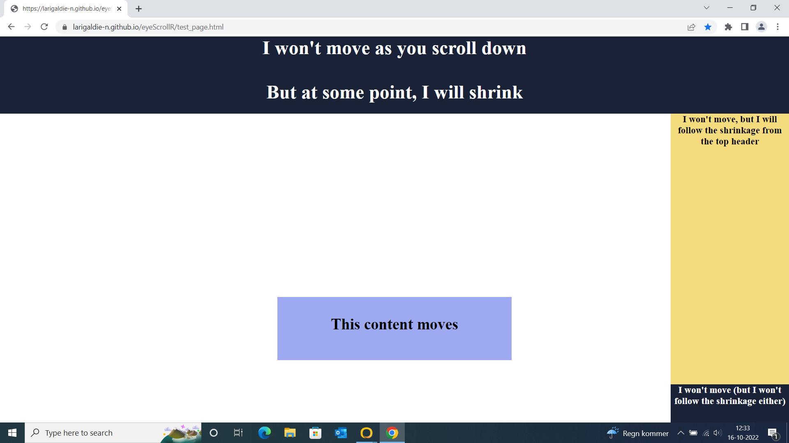
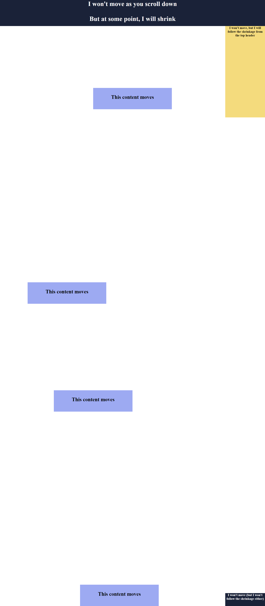
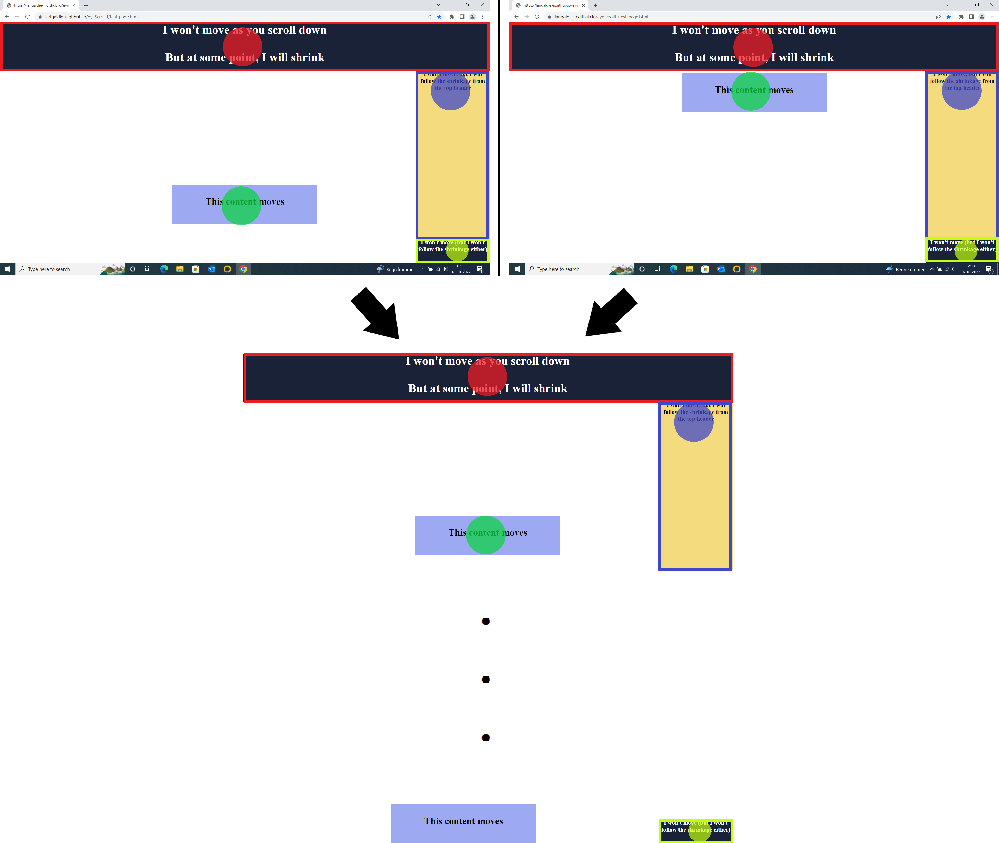
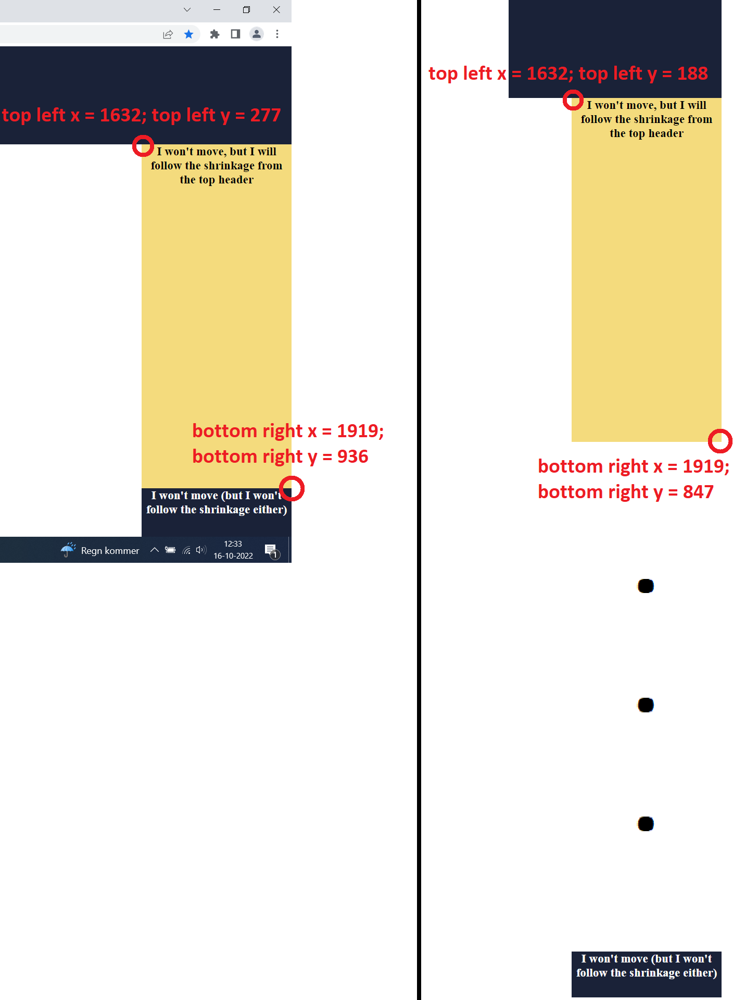
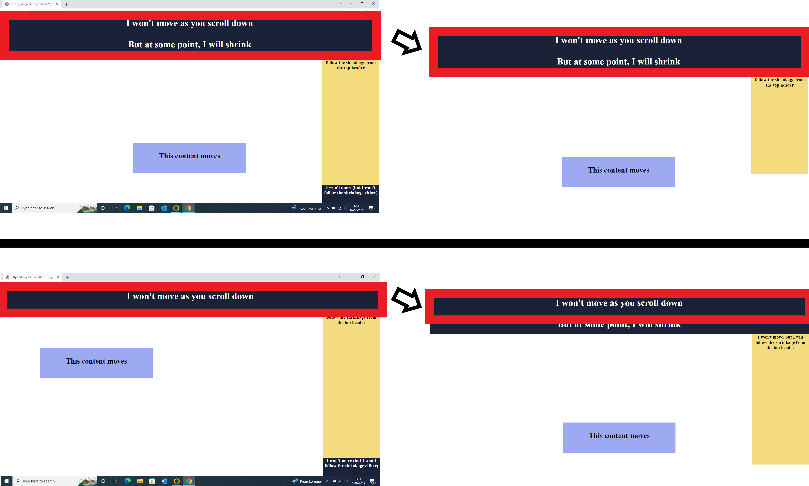
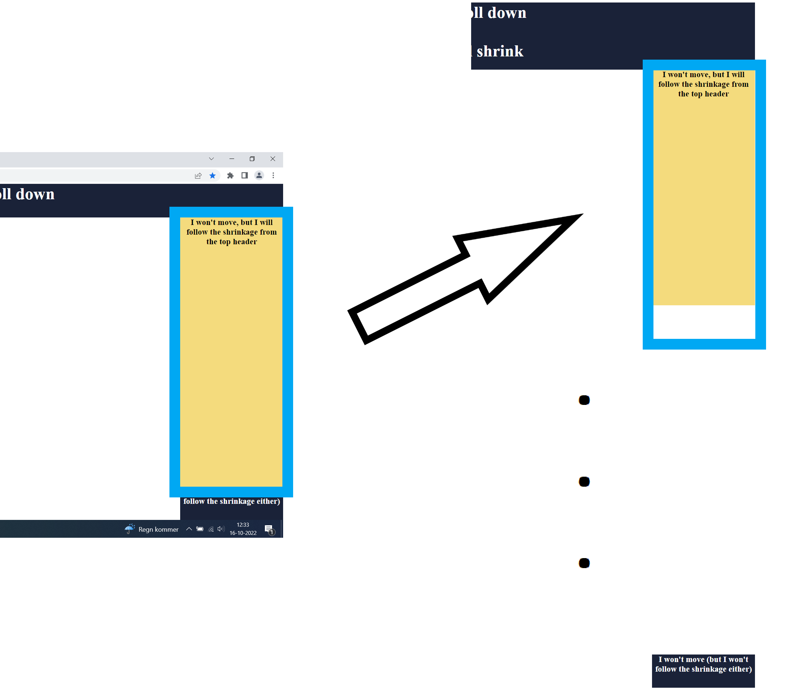
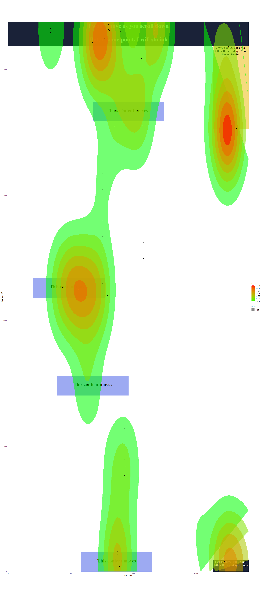

```{r, include = FALSE}
knitr::opts_chunk$set(
  collapse = TRUE,
  comment = "#>"
)
```

# The fixed_areas list

Lots of website nowadays have areas that do not move with the rest of the scrolled areas. Typically those are navigation menus at the very top and/or on the right, and footers. The problem with those is that even if the page has been scrolled to the very bottom, gazing at the top menu means that, on the unscrolled webpage image, the gaze has suddenly moved from the very bottom of the page to the very top without scrolling back.

For instance, consider this website (which you can find [here](../test_page.html "test page")):

```{r, echo=FALSE, out.width="100%"}

```

For the moment, let's just ignore the fact that the top area ends up shrinking at some point; we will come back to this later.

Areas at the top and on the right are all fixed, so if you scroll down a little, only some of the content is actually moving on the screen. The unscrolled webpage image may look like this (although the result may slightly differ depending on the plugin you are using to extract the image):

```{r, echo=FALSE, out.width="100%"}

```

What we really want, is to instruct the program that no matter how far down we scrolled, there are areas on the screen that will always be mapped to the same area on the webpage image (while the rest may move around).

In the below example, we show how slightly scrolling down (while fixating the same content) should only make the program apply a scroll correction to the fixation on the scrollable content (green dot), while redirecting the fixed areas to other fixed areas across the webpage image (red, blue and yellow dots). As such, fixations on the top right image after a few scrolls should result in the exact same heatmap as on the top left image, before any scroll were made.

```{r, echo=FALSE, out.width="100%"}

```

The way to achieve this in eyeScrollR is, as the rectangles in the above image suggested, to map a fixed relationship between areas from the screen to areas on the image. Fixations in the red rectangle on the screen should always map to fixations in the red rectangle on the image, the blue area on the screen should always map to blue rectangle on the image, and the yellow area on the screen should always map to yellow rectangle on the image.

In a similar way as the manual calibration procedure, just open a screenshot of your screen while browsing the website, and get the coordinates of the top left and bottom right pixels of any fixed area you want to map to your unscrolled image. Once this is done, you can do the same with the destination coordinates on the unscrolled image, as so:

```{r, echo=FALSE, out.width="100%", fig.cap = "Left: the screenshot image; Right: the unscrolled webpage image"}

```

Repeat the process for every fixed area you may encounter. All that is left to do now is to actually pass these coordinates in a form the package can recognize. In order to do that, you just need to create pairs of coordinate vectors, and pass these to the fixed_areas_bundle function as vectors with the form *c(top_left_x, top_left_y, bottom_right_x, bottom_right_y)*. For example, we measured the following values:

```{r eval=FALSE}
# These two are the top header
top_fixed_area_screen <- c(0, 89, 1919, 276)
top_fixed_area_image <- c(0, 0, 1919, 187)
# These two are the yellowish area on the right
right_fixed_area_screen <- c(1632, 277, 1919, 936)
right_fixed_area_image <- c(1632, 188, 1919, 847)
# These two are the bottom right area
bottom_right_fixed_area_screen <- c(1632, 937, 1919, 1029)
bottom_right_fixed_area_image <- c(1632, 4284, 1919, 4376)

area_bundle <- fixed_areas_bundle(top_fixed_area_screen,
                                  top_fixed_area_image,
                                  right_fixed_area_screen,
                                  right_fixed_area_image,
                                  bottom_right_fixed_area_screen,
                                  bottom_right_fixed_area_image)

fixed_areas <- list(area_bundle)
```

It is imperative that you pass the arguments in ordered pairs of screen-to-image mappings, and that you put the result in a list (we will come to the reason why in the next section). Your rectangles MUST also have the exact same dimensions.

Once this is done, and provided that you already did the calibration procedure, simply pass the *fixed_areas* argument to the *eye_scroll_correct* function:

```{r eval=FALSE}
corrected_data <- eye_scroll_correct(eyes_data = test_data,
                                     timestamp_start = 3577,
                                     timestamp_stop = 30864,
                                     image_width = 1920,
                                     image_height = 4377,
                                     calibration = calibration,
                                     fixed_areas = fixed_areas)
```

# The rules list

The most complicated use-case scenario that eyeScrollR can handle is when those fixed areas have a somewhat dynamic behaviour. The most common example is a top menu bar that shrinks (or even disappears!) when a certain number of pixels have been scrolled down. In these situations, if a screen-to-image direct mapping is still meaningful across the different possible states of the webpage, it is possible to create several bundles of fixed areas mappings, and create rules to instruct the package which bundle should be used at what time.

For instance, you could create a bundle of mappings to be used when a user has not scrolled down yet, and another one to be used only once they have.

The [example](../test_page.html "test page") we provide is a situation in which the screen-to-image mapping is still meaningful. Indeed, although the top area shrinks, what remains can still be perfectly mapped to the unscrolled image, as the whole area of the shrunken header still has perfect correspondance (as so the bottom right area):

```{r, echo=FALSE, out.width="100%", fig.cap = "Top: before the shrinking; Bottom: after the shrinking"}

```

The right area is a critical-case scenario, where the researcher will have to make a decision and may solve things creatively. Indeed, the size of this area once the header has shrunk is now bigger than the one we got on the captured unscrolled image. We can therefore no longer make a perfect mapping of the two areas. In some cases, this might mean that it is impossible to map everything in a single image, and you might consider splitting your participant's data to have several images.

However in this particular case, we can choose to ignore this, or even do some manual editing to the unscrolled image to expand the area! Indeed, the empty area below the one we are interested in is never reachable to an observer: there will always be something on the right of the page, and the long band of white is only an artifact of the screenshot plugin. As such, it is no problem to just make the following mapping:

```{r, echo=FALSE, out.width="100%"}

```

In this situation, the bottom right coordinates of the fixed area on the unscrolled image can be calculated by making sure the two areas have the exact same size.

In our case, we ended up with the following measures:

```{r eval=FALSE}
# These two are the top header
top_fixed_area_bis_screen <- c(0, 89, 1919, 182)
top_fixed_area_bis_image <- c(0, 0, 1919, 93)
# These two are the yellowish area on the right
right_fixed_area_bis_screen <- c(1632, 183, 1919, 936)
right_fixed_area_bis_image <- c(1632, 188, 1919, 941)
# These two are the bottom right area
bottom_right_fixed_area_bis_screen <- c(1632, 937, 1919, 1029)
bottom_right_fixed_area_bis_image <- c(1632, 4284, 1919, 4376)

area_bundle_bis <- fixed_areas_bundle(top_fixed_area_bis_screen,
                                  top_fixed_area_bis_image,
                                  right_fixed_area_bis_screen,
                                  right_fixed_area_bis_image,
                                  bottom_right_fixed_area_bis_screen,
                                  bottom_right_fixed_area_bis_image)

fixed_areas <- list(area_bundle, area_bundle_bis)
```

This time, the fixed_areas list comprises two bundles of mappings: the one that should be used BEFORE the user has scrolled down enough to shrink the top header, and the one that should be used AFTER.

The only thing left to do is to create a *rules* list, so that the package can know when to use which bundle.

rules are functions that check, at each line of the .csv file, if conditions to use a bundle are met or not. In our case here, we would need a first rule asking if the user has not scrolled down a sufficient amount of pixels to shrink the header, in which case the first bundle of fixed areas should be used (and that is would cease to be used once this amount of pixels has been scrolled). And we would also need a second rule, asking the exact opposite for the second bundle. Finding the conditions changing the fixed areas may require a bit of experimenting on the field. In our website example, the header just retracts when more than 1000 pixels have been scrolled down, and expands again in the other case.

The *eye_scroll_correct* function calls all rule functions at every line of the .csv file, and pass them a lot of arguments to work on. Working on complex set of rules is possible, but in any case, it will require you to write your own functions. The scenario presented here is easy enough to be modified whatever you level of expertise in R is, and should solve the vast majority of the use-case scenarios.

```{r eval=FALSE}
rule_scrolled_up <- function (data_line, array_fixed_areas, flag, scroll)
{
    if (scroll <= 1000)
    {
        return (TRUE)
    }
    else
    {
        return (FALSE)
    }
}

rule_scrolled_down <- function (data_line, array_fixed_areas, flag, scroll)
{
    if (scroll > 1000)
    {
        return (TRUE)
    }
    else
    {
        return (FALSE)
    }
}

rules <- list(rule_scrolled_up, rule_scrolled_down)
```

The order of these rules must be the same as the order of the fixed areas bundles. In our case, the *rule_scrolled_up* rule will therefore make sure that the first bundle of fixed areas will be used when less than 1000 pixels have been scrolled down, and no longer be used should it not be the case. Similarly, the *rule_scrolled_down* rule will be associated with the second bundle of fixed areas. You can then just pass this list of rules to the *eye_scroll_correct* function:

```{r eval=FALSE}
corrected_data <- eye_scroll_correct(eyes_data = test_data,
                                     timestamp_start = 3577,
                                     timestamp_stop = 30864,
                                     image_width = 1920,
                                     image_height = 4377,
                                     calibration = calibration,
                                     fixed_areas = fixed_areas,
                                     rules = rules)
```

# A complete, commented code for our example

```{r eval=FALSE}
library(eyeScrollR)
library(png)
library(readr)

################################################################################
# General settings
# Same for every data file for a given webpage
# (aka "do this only once per webpage, then stop thinking about it")
################################################################################

### Automatic calibration
calibration_image <- readPNG("calibration_chrome.png")
calibration <- scroll_calibration_auto(calibration_image, 125)

### Fixed area bundles
## First bundle: when not scrolled down yet
# These two are the top header
top_fixed_area_screen <- c(0, 89, 1919, 276)
top_fixed_area_image <- c(0, 0, 1919, 187)
# These two are the yellowish area on the right
right_fixed_area_screen <- c(1632, 277, 1919, 936)
right_fixed_area_image <- c(1632, 188, 1919, 847)
# These two are the bottom right area
bottom_right_fixed_area_screen <- c(1632, 937, 1919, 1029)
bottom_right_fixed_area_image <- c(1632, 4284, 1919, 4376)

area_bundle <- fixed_areas_bundle(top_fixed_area_screen,
                                  top_fixed_area_image,
                                  right_fixed_area_screen,
                                  right_fixed_area_image,
                                  bottom_right_fixed_area_screen,
                                  bottom_right_fixed_area_image)

## Second bundle: when scrolled down enough
# These two are the top header
top_fixed_area_bis_screen <- c(0, 89, 1919, 182)
top_fixed_area_bis_image <- c(0, 0, 1919, 93)
# These two are the yellowish area on the right
right_fixed_area_bis_screen <- c(1632, 183, 1919, 936)
right_fixed_area_bis_image <- c(1632, 188, 1919, 941)
# These two are the bottom right area
bottom_right_fixed_area_bis_screen <- c(1632, 937, 1919, 1029)
bottom_right_fixed_area_bis_image <- c(1632, 4284, 1919, 4376)

area_bundle_bis <- fixed_areas_bundle(top_fixed_area_bis_screen,
                                      top_fixed_area_bis_image,
                                      right_fixed_area_bis_screen,
                                      right_fixed_area_bis_image,
                                      bottom_right_fixed_area_bis_screen,
                                      bottom_right_fixed_area_bis_image)

### Now, the rule functions
# The first one, when we are below 1000 pixels scrolled
rule_scrolled_up <- function (data_line, array_fixed_areas, flag, scroll)
{
  if (scroll <= 1000)
  {
    return (TRUE)
  }
  else
  {
    return (FALSE)
  }
}

# The second one, when we are above 1000 pixels scrolled
rule_scrolled_down <- function (data_line, array_fixed_areas, flag, scroll)
{
  if (scroll > 1000)
  {
    return (TRUE)
  }
  else
  {
    return (FALSE)
  }
}

# Create the fixed_areas list with both bundles, and associate rules by putting
# them in the same order
fixed_areas <- list(area_bundle, area_bundle_bis)
rules <- list(rule_scrolled_up, rule_scrolled_down)

################################################################################
# Participant-specific code
################################################################################
# Read data, and make sure labels are alright
test_data <- read_csv("fixed_areas.csv", comment = "#")
names(test_data) <- make.names(names(test_data))

# Apply the scroll corrections
corrected_data <- eye_scroll_correct(eyes_data = test_data,
                                     timestamp_start = 8504,
                                     timestamp_stop = 70478,
                                     image_height = 4377,
                                     image_width = 1920,
                                     calibration = calibration,
                                     fixed_areas = fixed_areas,
                                     rules = rules)

# Read the unscrolled image
heatmap_image <- readPNG("fixed_website.png")

# Output the heatmap
generate_heatmap(data = corrected_data, heatmap_image = heatmap_image)
```

```{r, echo=FALSE, out.width="100%"}

```
